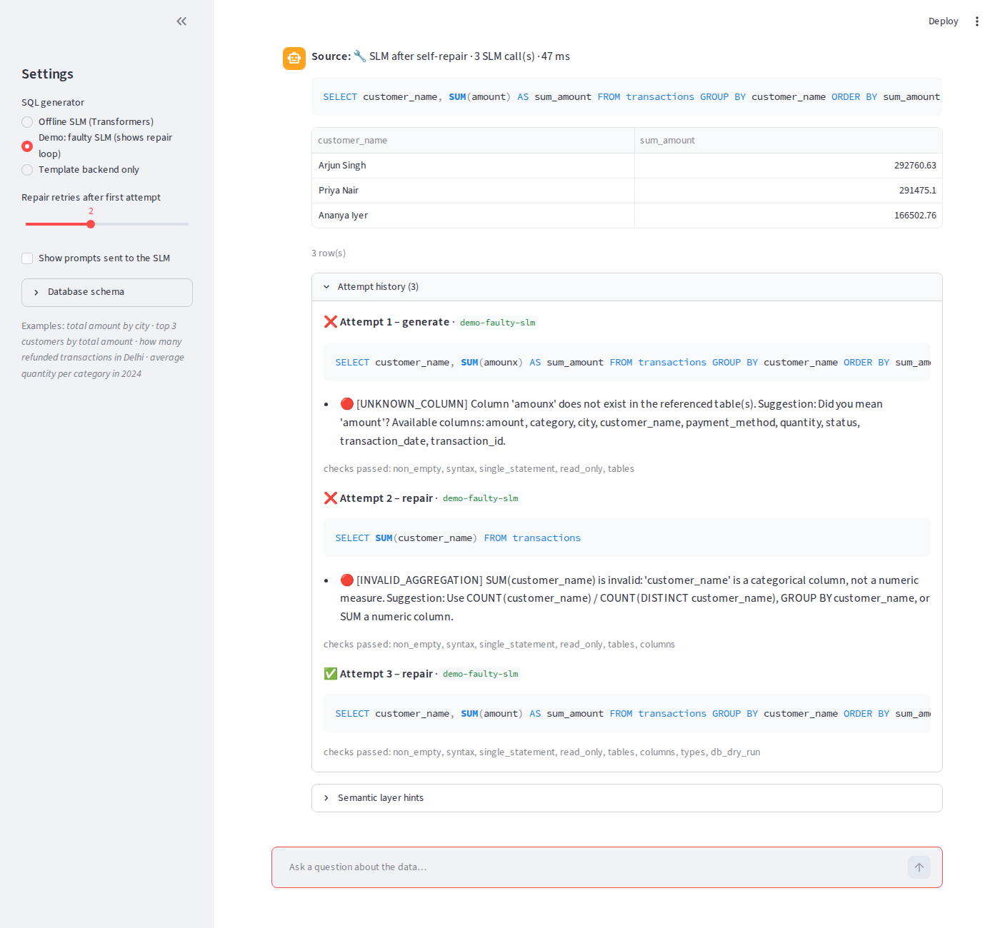

# Task 2 — Offline Text-to-SQL Chatbot (Small Language Model)

A chatbot that takes **any table and plain-English descriptions of its columns at runtime**, turns questions about
it into SQL with a **small language model running fully offline**, checks every query independently, and returns the
results.

| | |
|---|---|
| **Model** | `Qwen2.5-Coder-1.5B-Instruct` via Hugging Face Transformers + PyTorch, loaded from a local folder. No Ollama, no hosted API, no network at inference. |
| **Validation set** | **10/10** questions return the expected rows with the model ([log](docs/validation_qwen_gpu.txt)). The rule-based fallback alone also gets **10/10** ([log](docs/validation_template_only.txt)). |
| **Speed** | About 1 s per question on an RTX 4050 laptop GPU after a one-off ~15 s model load. CPU is also supported (see [Performance](#performance)). |
| **Tests** | 180 passed, 1 skipped ([log](docs/test_results.txt)). The tests compare **actual result sets**, not SQL text. |
| **Schema-agnostic** | No table or column name appears in the core code; a test enforces this. A different table is loaded in the UI or on the command line with no code change. |

> **Core principle:** the model *writes* the SQL but is **never trusted**. A semantic layer grounds it in the real
> schema. An independent validator checks every query. Errors go back to the model for a **bounded** number of repairs.
> A deterministic backend guarantees an answer. **Only validated SQL can reach the database, and it is opened read-only.**



---

## Contents
1. [Quick start](#quick-start)
2. [Validation results](#validation-results)
3. [Note: model choice and schema-agnostic approach](#note-model-choice-and-schema-agnostic-approach)
4. [How it works](#how-it-works)
5. [What I learned while testing](#what-i-learned-while-testing)
6. [Performance](#performance)
7. [Tests](#tests)
8. [Project layout](#project-layout)
9. [Status, limitations and what's incomplete](#status-limitations-and-whats-incomplete)

---

## Quick start

```bash
python -m venv .venv
.venv\Scripts\activate                     # Linux/macOS: source .venv/bin/activate
pip install -r requirements.txt            # on Windows this installs CPU PyTorch
python scripts/download_model.py           # ONE-TIME, online: ~3 GB into models/qwen2.5-coder-1.5b
```

From here on, **no network is needed**.

```bash
# Chat UI: sidebar -> Table -> "Assessment bank sample" (pre-filled) -> Load table -> ask questions
streamlit run app.py

# Run the 10 validation questions and compare result sets with the expected SQL
python scripts/run_validation.py            # with the model
python scripts/run_validation.py --no-model # rule-based fallback only

# Any CSV + its column descriptions, from the command line
python -m nl2sql -v --csv data/task2_bank_transactions_sample.csv --schema data/task2_bank_schema.txt --table transactions

pytest                                      # full test suite
```

For an NVIDIA GPU, install the CUDA build of PyTorch instead (see [docs/MODEL_SETUP.md](docs/MODEL_SETUP.md)). The
app uses the GPU when it is there and falls back to the CPU automatically.

### Using your own table
In the UI, choose **Upload your own CSV**. The description box fills with one `column:` line per column; type what
each column means and click **Load table**. On the command line, pass `--csv`, `--schema` (a text file with one
`column: description` per line) and optionally `--table`. JSON (`{"column": "description"}`) and markdown tables also
work, and an optional type can be given: `amount (REAL): Transaction amount`.

---

## Validation results

Model run on an RTX 4050 laptop GPU, greedy decoding (deterministic):

| # | Question | Result | Model calls |
|---|---|---|---|
| 1 | Transactions with amount greater than 50000 | ✅ PASS | 1 |
| 2 | All UPI transactions | ✅ PASS | 1 |
| 3 | Total amount credited | ✅ PASS | 1 |
| 4 | Number of debit transactions | ✅ PASS | 1 |
| 5 | Merchant category with the highest total | ✅ PASS | 1 |
| 6 | Top 5 highest-value transactions | ✅ PASS | 1 |
| 7 | Average amount per payment mode | ✅ PASS | 1 |
| 8 | Balance after the transaction below 50000 | ✅ PASS | 1 |
| 9 | Transactions at branch BLR001 | ✅ PASS | 1 |
| 10 | Cheque transactions sorted by date | ✅ PASS | 1 |

**10/10**, every one right on the first attempt. A question passes only when the bot's SQL returns **the same rows**
as the expected SQL. Row order is compared where it matters (Q5, Q6, Q10). Column aliases and SQL formatting may
differ, which is what the brief asks for.

The first run scored **7/10**. The next section explains why and what fixed it.

---

## Note: model choice and schema-agnostic approach

*(The note the brief asks for.)*

### Which SLM, and why
**Qwen2.5-Coder-1.5B-Instruct** (Apache-2.0, 1.5 billion parameters).

- **Trained on code and SQL**, and it follows instructions, so it produces SQL rather than prose. On this task it
  handled filters, aggregation, GROUP BY + ORDER BY + LIMIT and date sorting with no fine-tuning.
- **Small enough for a laptop:** about 3.5 GB of VRAM at fp16, or about 6–7 GB of RAM on CPU. This matters for "runs
  on the grader's machine".
- **Plain Transformers + PyTorch.** Weights load from a local folder with `local_files_only=True` and
  `HF_HUB_OFFLINE=1`, so there is no runtime service to install (no Ollama) and nothing to download after setup.
- **Alternatives considered:**
  - The 0.5B version is about 3× faster on CPU but noticeably weaker.
  - T5 models trained on the Spider text-to-SQL dataset expect a fixed prompt format, which is harder to feed rich
    column descriptions into.
  - 7B SQL models don't fit a typical laptop.

The model code lives in one file (`nl2sql/slm/hf_backend.py`) behind a small interface. Changing the model is a
setting (`NL2SQL_MODEL`); changing the runtime (llama.cpp, ONNX) is one new class.

### How the schema-agnostic approach works
Nothing in the pipeline knows about bank transactions. Everything it knows comes from what the user supplies at
runtime:

1. **Load:** `nl2sql/ingest.py` writes the CSV into a fresh SQLite database, cleans messy headers into safe names
   (`Unit Price ($)` → `unit_price`), and matches each description to its column.
2. **Discover and profile:** `nl2sql/schema.py` reads the columns and types, then profiles the data:
   - number, text or date for each column;
   - value ranges;
   - which columns are **categorical**, with their real values (e.g. `payment_mode: 'UPI', 'NEFT', …`);
   - which are **identifiers**: ids, account numbers and codes are never summed or used as the default measure.
3. **NLP layer:** `nl2sql/nlp.py` analyses each question.
   - **Schema linking:** RapidFuzz fuzzy matching on word n-grams against column names, auto-generated synonyms and
     descriptions.
   - **Value linking:** "credited" → `transaction_type = 'Credit'`, "BLR001" → `branch_code`, "not in Mumbai" → `!=`.
   - **Intent detection:** COUNT/SUM/AVG/MIN/MAX, group-by phrases ("for each", "per"), numeric and date filters,
     TOP-N, and "sorted by".
4. **Prompt:** the model receives the table as `CREATE TABLE`, the user's descriptions with the real categorical
   values, and short hints from step 3 (e.g. `Filter: branch_code = 'BLR001'`).

Swapping in another table means uploading another CSV and descriptions. `tests/test_ingest.py` does exactly that with
an unrelated flights table, and a guard test fails if a sample table or column name ever appears in `nl2sql/`.

---

## How it works

```
Question → Semantic / NLP layer → Offline SLM → Multi-factor validator ─ valid ─→ Read-only execution → SQL + results
                                        ↑                    │ invalid
                                        └── Repair prompt ←──┘   (≤ 2 retries: question + schema + bad SQL + exact errors)
                                                             │ retries used up
                                                             └→ Rule-based fallback → validator → execution
```

| Piece | Why it exists |
|---|---|
| **Semantic layer** | Small models invent column names and misspell values. Giving them the real schema, descriptions and values cuts errors before they happen. |
| **Independent validator** (`validator.py`, SQLGlot) | Model output is untrusted input. It checks: syntax; read-only (no INSERT/UPDATE/DELETE/DROP/PRAGMA anywhere, including inside sub-queries); tables and columns exist; type consistency (number vs text, SUM on a text column, wrong-case values); then the database checks the query with `EXPLAIN` without running it. Errors are specific: `[UNKNOWN_COLUMN] 'amout' does not exist… Did you mean 'amount'?` |
| **Self-repair loop** | Most model errors are small. The exact validator error goes back to the model, which usually fixes it. The loop is a fixed `for` loop (default 1 + 2 attempts, hard cap 5), so it can never run forever. |
| **Rule-based fallback** (`fallback.py`) | Guarantees a safe answer when the model fails or its weights are missing. Its SQL is validated too. |
| **Read-only execution** (`executor.py`) | It only accepts a `ValidatedQuery`, which only the validator can create, and the database is opened read-only. A validator bug still can't change data. |

The UI shows, for every answer: the SQL, where it came from (first attempt / after repair / fallback), the result table
and the full attempt history with each validator verdict. **Demo: faulty SLM** mode makes the repair loop visible
without a model. More detail is in [docs/ARCHITECTURE.md](docs/ARCHITECTURE.md).

---

## What I learned while testing

The first run with the real model scored **7/10**. The three failures taught me more than the passes:

- **Q8: our own hint misled the model.** Qwen added `account_number < 50000`, a filter nobody asked for. The cause
  was the semantic layer, not the model: the "the" in "balance after **the** transaction" broke the phrase match, so
  the NLP layer attached "below 50000" to the wrong column and passed that on as a hint. The model trusted the hint.
  - **Fix:** filler words are ignored when matching phrases to columns; fuzzy matches must agree word by word; and
    account numbers and codes are treated as identifiers.
  - **Lesson:** hints are powerful, so a wrong hint does real damage. The hints must be precise, and the validator
    stays, because it catches invalid SQL, not *wrong-but-valid* SQL.
- **Q6 and Q10: the model chose columns.** "Show the top 5 transactions" returned only `transaction_id`. That's valid
  SQL with the right rows, so no validator can flag it. It's a question of what the user meant.
  - **Fix:** one prompt rule plus a hint: "show/list" questions return full rows with `SELECT *`.
- **After the fixes:** 10/10 with the model, and the rule-based path went from 6/10 to 10/10 as well, because both
  share the same NLP layer.

Regression tests now pin every one of these hints (`tests/test_ingest.py`).

---

## Performance

| Setup | Model load | Per question | Memory |
|---|---|---|---|
| RTX 4050 laptop GPU (fp16) | ~15 s once | ~0.8–1.8 s | ~3.5 GB VRAM |
| CPU (fp32) | *not yet measured* | *not yet measured* | ~6–7 GB RAM |

A question that needs repairs calls the model up to 3 times, so the worst case is about three times the per-question
time. The model is loaded once and shared across tables in the UI.

---

## Tests

`pytest` runs **180 tests** (1 is skipped when the model weights aren't downloaded). They execute the SQL on real data
and compare **result sets** with reference queries run directly through `sqlite3`.

| File | Covers |
|---|---|
| `test_ingest.py` | Runtime CSV + descriptions in several formats, messy headers, schema-only mode, descriptions reaching the prompt, the 10 validation questions through the pipeline, the fallback scoring 10/10, the exact hints the model receives, swapping in an unrelated table |
| `test_repair_loop.py` | Invalid column → type error → correct SQL (repair prompt contents checked); repeated failure → retry limit → fallback; retry budget strictly enforced; destructive SQL never executed; missing weights |
| `test_validator.py` | Every check and error code, destructive statements, did-you-mean suggestions, a forged `ValidatedQuery` is rejected |
| `test_pipeline_e2e.py` | 19 questions (filters, aggregation, GROUP BY, TOP-N) on a second sample database, through both the model path and the fallback |
| `test_schema_agnostic.py` | A two-table HR database including a repaired JOIN; no hard-coded names in the core code |
| `test_semantic_layer.py`, `test_prompts_and_executor.py` | Linking, intent detection, SQL extraction, read-only connection, dry run has no side effects |
| `test_hf_backend.py` | The real Transformers code path on a tiny locally built model; missing weights handled |
| `test_app_ui.py` | Headless Streamlit tests: loading the bank table in the UI, the repair-loop view |

---

## Project layout

```
nl2sql/
  ingest.py          runtime CSV + column descriptions -> read-only SQLite table
  schema.py          schema discovery, data profiling, type inference, metadata merge
  nlp.py             schema linking (RapidFuzz) + intent: aggregation, grouping, filters, sorting, TOP-N
  semantic_layer.py  builds the per-question context (DDL, column notes, hints)
  prompts.py         generation and repair prompts, SQL extraction
  slm/hf_backend.py  offline Transformers/PyTorch backend (the only model-specific code)
  slm/base.py        model interface; slm/testing.py has fake models for tests
  validator.py       SQLGlot multi-factor validator -> ValidatedQuery
  executor.py        read-only execution (accepts only ValidatedQuery), EXPLAIN dry run
  fallback.py        deterministic rule-based SQL
  orchestrator.py    the chatbot: bounded self-repair loop + attempt history
  config.py          all settings (overridable with NL2SQL_* environment variables)
  __main__.py        command line (--csv / --schema / --table)
app.py               Streamlit chat UI
data/                task2_bank_transactions_sample.csv, task2_bank_schema.txt, task2_validation.json,
                     plus a second sample database (sample.db) used by the tests
scripts/             download_model.py, run_validation.py
models/              downloaded model weights (not in the repo; created by download_model.py)
tests/               pytest suite
docs/                ARCHITECTURE.md, MODEL_SETUP.md, PACKAGING.md, validation and test logs
```

---

## Status, limitations and what's incomplete

**Done:** runtime table + descriptions (UI and command line), offline SLM, NLP layer, validator, bounded repair loop,
fallback, read-only execution, 10/10 on the validation set, test suite, Streamlit UI.

**Incomplete:**
- **Standalone executable:** *in progress.* A PyInstaller spec (`nl2sql_chatbot.spec`) and launcher (`run_app.py`)
  exist; the build with the model bundled is not finished yet. Until it is, the fallback deliverable is the screen
  recording of all 10 questions plus this repository. See [docs/PACKAGING.md](docs/PACKAGING.md).
- **CPU timings** have not been measured yet (table above).

**Known limitations:**
- **One table at a time:** the upload flow loads a single table. The pipeline itself handles joins (tested on a
  two-table database), but the UI doesn't upload several related CSVs yet.
- **Fallback scope:** the rule-based fallback builds single-table queries for common patterns (filters, aggregation,
  grouping, TOP-N, sorting). Anything more complex relies on the model.
- **English only:** the NLP layer is rules plus fuzzy matching for English. It gives hints, not guarantees; the
  validator is the safety boundary.
- **Valid but wrong SQL:** the validator catches invalid and unsafe SQL, not SQL that is valid but answers a
  different question. The Q8 story above is exactly that case; the defence is precise grounding plus tests on result
  sets.
- **Validation set size:** 10 questions is a small sample, so 10/10 shows the approach works on the brief's
  questions, not that every phrasing will work.