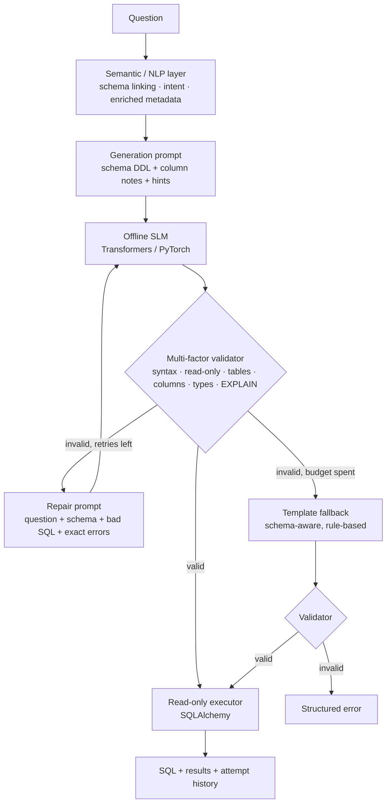

# Architecture

## Guiding principle

> The SLM is responsible for **generating** SQL, but it is **not trusted** to generate correct SQL.

The semantic layer grounds the model in the real schema, an independent validator checks every candidate,
validator errors are fed back to the model for **bounded** self-correction, a deterministic backend guarantees an
answer, and only validated SQL can reach the database.

## Flow

With the default `max_repair_retries = 2`, the SLM is called **at most 3 times** (1 generation + 2 repairs).
The loop is `for i in range(1 + retries)` with a hard cap of 5 retries, so it can never run unbounded.

## Components

| Module | Responsibility | Key design points |
|---|---|---|
| `nl2sql/config.py` | All tunables (`PipelineConfig`, `ModelConfig`), env-overridable (`NL2SQL_*`) | No component reads env vars itself |
| `nl2sql/schema.py` | Schema model + introspection | SQLAlchemy inspector (tables, types, PK/FK) → profiling (row counts, distinct counts, categorical values, min/max) → type inference for loosely-typed SQLite columns → optional metadata JSON merge |
| `nl2sql/nlp.py` | Schema linking + intent | RapidFuzz over word n-grams with singularisation; value linking for categorical columns (incl. typos, negation); COUNT/SUM/AVG/MIN/MAX, GROUP BY triggers, numeric/BETWEEN/year filters, sort direction, TOP-N |
| `nl2sql/semantic_layer.py` | Builds the `SemanticContext` for each question | Auto-synonyms from identifiers (`qty`→quantity, `product_name`→product), schema pruned to relevant + FK-related tables, hints |
| `nl2sql/prompts.py` | Generation / repair prompts, SQL extraction | Prompts are data (`Prompt`), rendered by each backend as it needs |
| `nl2sql/slm/` | Model backends behind `SQLGenerator` | `hf_backend.py` is the only model-specific code (causal chat or seq2seq, offline, greedy). `testing.py` has scripted doubles |
| `nl2sql/validator.py` | Independent multi-factor validation | SQLGlot AST + scope analysis; structured `ValidationIssue(code, check, message, identifier, suggestion)`; mints `ValidatedQuery` |
| `nl2sql/executor.py` | Execution | Accepts only `ValidatedQuery`; SQLite opened `mode=ro` + `PRAGMA query_only`; `EXPLAIN` dry run; row cap |
| `nl2sql/fallback.py` | Deterministic template backend | Builds SQL with SQLGlot's expression builder (quoted literals, real identifiers); output is validated like any candidate |
| `nl2sql/orchestrator.py` | The chatbot | Wires the loop, records `Attempt` history, returns `ChatResponse` |
| `app.py` | Streamlit UI | SQL, results, source badge, attempt history with validator verdicts, hints |

## Validator checks

| # | Check | Error codes | Example caught |
|---|---|---|---|
| 1 | non-empty | `EMPTY_SQL` | model returned prose only |
| 2 | syntax (SQLGlot) | `SYNTAX_ERROR` (with line/column) | `SELECT sum(amount FROM t` |
| 3 | single statement | `MULTIPLE_STATEMENTS` | `SELECT …; DROP TABLE …` |
| 4 | read-only (whole AST) | `NOT_READ_ONLY` | `DELETE`, `UPDATE`, `PRAGMA`, `ATTACH`, DML inside a CTE |
| 5 | tables | `UNKNOWN_TABLE` + did-you-mean | `FROM transaction` |
| 6 | columns / identifiers | `UNKNOWN_COLUMN`, `UNKNOWN_TABLE_ALIAS`, `AMBIGUOUS_COLUMN` | `amout`, `x.city`, unqualified `dept_id` in a join, `"Mumbai"` in double quotes |
| 7 | types | `TYPE_MISMATCH`, `INVALID_AGGREGATION`, `UNKNOWN_VALUE`; warnings `UNGROUPED_COLUMN`, LIKE on numeric, SUM of an id | `amount > 'Mumbai'`, `SUM(city)`, `date = 2024`, `city = 'mumbai'` |
| 8 | DB dry run (`EXPLAIN`) | `DB_ERROR` | unknown functions such as `median()` |

Errors block execution; warnings are reported but do not.

## Why each layer exists

* **Semantic layer** – small models hallucinate identifiers and miss categorical spellings. Giving them DDL, descriptions,
  synonyms, real categorical values and intent hints cuts errors *before* they happen, and the same analysis powers the
  fallback, so no knowledge is duplicated.
* **Independent validator** – the model's output is untrusted input. Validation is deterministic, explainable and cheap;
  it is the only way to mint a `ValidatedQuery`, and the executor only accepts that type, so the guarantee is enforced
  by the type system rather than by convention.
* **Repair loop** – most SLM errors are local (a misspelled column, wrong quoting, SUM on text). A precise error message
  plus a "did you mean" suggestion is usually enough for the model to fix it, which preserves the model's flexibility
  (joins, subqueries, phrasing the templates cannot cover) instead of dropping straight to templates.
* **Bounded retries** – latency and cost stay predictable; a model stuck on a mistake cannot loop forever.
* **Template fallback** – a guaranteed, safe answer for common analytical intents when the model fails or the weights
  are missing. It is intentionally narrow (single table) and is treated as a reliability net, not the main generator.
* **Read-only execution** – defence in depth: even a validator bug cannot write to the database.

## Swapping the model

Implement `SQLGenerator.generate(prompt) -> str` (e.g. llama.cpp, ONNX Runtime, vLLM) and pass it to
`NL2SQLChatbot.from_config(slm=...)`. Nothing else changes. Any Hugging Face causal or seq2seq checkpoint works through
`NL2SQL_MODEL=<repo-or-path>`.

## Using another database

Point `NL2SQL_DB_URL` at any SQLite file (or other SQLAlchemy URL) and optionally supply a metadata JSON. The schema is
discovered at start-up; `tests/test_schema_agnostic.py` runs the unchanged pipeline on a two-table HR schema, and a
guard test fails if a sample-schema name ever appears in the core package.
